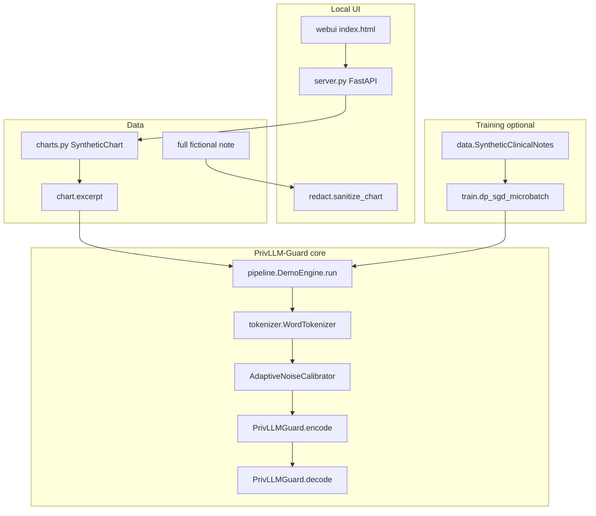
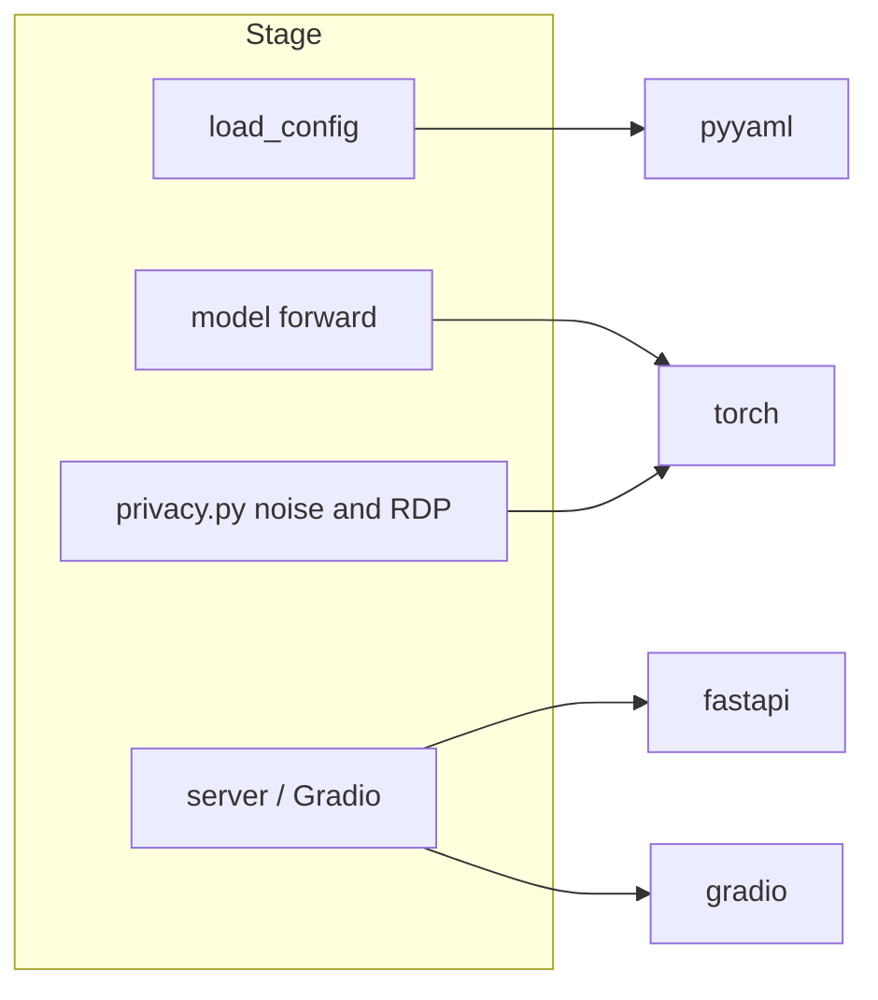
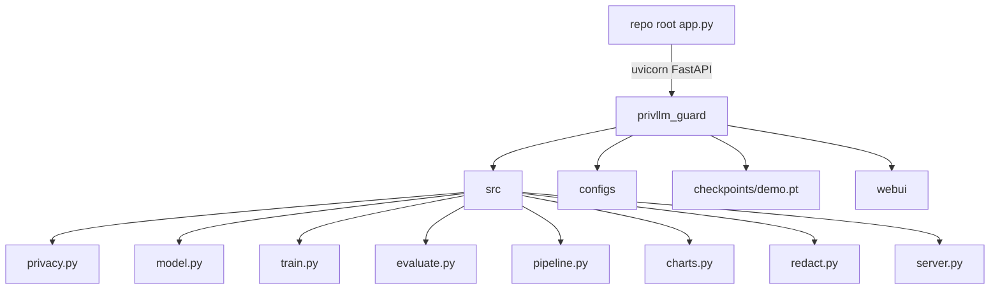

# ChartCloak

Hospitals and clinics want language models to help with notes — summarize a discharge summary, draft a progress note, pull out a medication list. The catch is obvious to anyone who has read a chart: those documents talk about real people. If you send the raw text to a model, or train a model on it carelessly, pieces of a patient’s story can leak back out.

**ChartCloak** is a laptop demo of that problem. Under the hood it implements **PrivLLM-Guard**, the method from Alghamdi’s 2026 *Scientific Reports* paper: a small encoder–decoder that injects calibrated Gaussian noise into embeddings and attention, splits a privacy budget across parts of the network, and tracks that budget while text is produced. A browser UI lets you open **fictional** charts, see a generalized version of the note, and run the tiny model on a short excerpt.

It is meant for students, researchers, and internship demos who want to see how the paper’s pieces fit together on a laptop — not for treating patients, and not as a claim that Table 2’s published BLEU numbers were reproduced here.

## The problem

Clinical text is useful for automation and dangerous for privacy at the same time. Names are only part of the issue. Age, rare jobs, small towns, and uncommon diseases can still point to one person. This repo explores one published answer: **differential privacy inside the model**, plus a demo layer that generalizes identifiers on synthetic charts for display.

## What you get

- A citation-anchored PyTorch stack under `privllm_guard/src/` (privacy math, model, losses, DP-SGD training, metrics).
- YAML configs for paper-scale settings (`configs/base.yaml`), a CPU walkthrough (`configs/walkthrough.yaml`), and a demo checkpoint (`configs/demo.yaml`).
- Ten fictional EHR-style charts in `src/charts.py` (fake names, MRNs like `SYN-4401`, invented phones and towns).
- A local FastAPI + static chart UI (`src/server.py`, `webui/`) at `http://127.0.0.1:8080`.
- An optional Gradio UI (`src/demo_ui.py`, `privllm_guard/app.py`).
- A pre-trained tiny CPU checkpoint at `privllm_guard/checkpoints/demo.pt` (overfits the synthetic excerpts for the demo).
- Reproduction notes that mark what the paper specified vs what was guessed (`REPRODUCTION_NOTES.md`).
- MIT license (`LICENSE`). Hosting notes in `DEPLOY.md`.

## Screenshots

Local chart review (fictional census, original note with planted identifiers marked):


After **Run ChartCloak**, the model tab shows the excerpt reconstructed without noise vs with DP noise:


## Pipeline



### One run of the chart UI

1. Browser loads `/` → `server.index` serves `webui/index.html`.
2. `GET /api/charts` → `list_charts()` returns the census.
3. `GET /api/charts/{id}` → full note, `sanitize_chart()`, `find_highlights()`.
4. `POST /api/run` → `DemoEngine.run(excerpt, epsilon)`:
   - `WordTokenizer.encode`
   - `PrivLLMGuard` forward with and without noise (`apply_noise`)
   - metrics: risk, σ, BLEU/ROUGE between reconstructions, hierarchical ε split
5. UI shows original note, generalized note, clean reconstruction, private reconstruction.

## Tools used

| Library | Role in this repo |
|---|---|
| `torch` | Encoder–decoder, DP-SGD, noise tensors |
| `pyyaml` | Load `configs/*.yaml` via `utils.load_config` |
| `numpy` | Declared; used lightly where needed |
| `fastapi` / `uvicorn` | Local chart API and static UI |
| `pydantic` | Request body for `/api/run` (via FastAPI) |
| `gradio` | Alternate demo UI in `demo_ui.py` |



## Architecture



Major folders:

| Path | What it holds |
|---|---|
| `privllm_guard/src/` | Library code: privacy, model, train, eval, charts, UI backends |
| `privllm_guard/configs/` | Hyperparameters (paper / walkthrough / demo) |
| `privllm_guard/webui/` | Chart-review HTML/CSS/JS |
| `privllm_guard/notebooks/` | Equation walkthrough notebook |
| `privllm_guard/scripts/` | `train_demo_checkpoint.py` |
| `docs/screenshots/` | Local UI captures |
| `web/` | Optional static Vercel shell (iframe only; does not run the model) |

## Results

There is **no** checked-in reproduction of the paper’s BLEU-4 = 0.897 / ROUGE-L = 0.923 on MIMIC-III. Those numbers appear only as citations in docs. What exists locally:

- Walkthrough notebook sanity checks for shapes and Privacy Score arithmetic.
- Demo checkpoint training logs from `scripts/train_demo_checkpoint.py` (toy loss on synthetic excerpts).
- Live UI metrics (cosine, BLEU between noisy and clean reconstructions) computed at runtime — not published benchmark tables.

## Quickstart (Windows)

From the **repo root** (wherever you cloned ChartCloak):

```powershell
python -m pip install -r requirements.txt
python app.py
```

Open [http://127.0.0.1:8080](http://127.0.0.1:8080).

Optional Gradio UI:

```powershell
cd privllm_guard
python app.py
```

Optional retrain of the tiny demo weights:

```powershell
cd privllm_guard
python scripts/train_demo_checkpoint.py
```

Optional DP-SGD toy loop:

```powershell
cd privllm_guard
python -m src.train
```

## Project tree

```text
.
├── LICENSE
├── README.md
├── .env.example
├── pytest.ini
├── app.py                          # starts FastAPI chart UI on :8080
├── requirements.txt
├── DEPLOY.md                       # hosting notes (HF PRO, Vercel limits)
├── docs/screenshots/
├── privllm_guard/
│   ├── app.py                      # Gradio entry
│   ├── configs/                    # base.yaml, walkthrough.yaml, demo.yaml
│   ├── checkpoints/demo.pt         # tiny CPU demo weights
│   ├── notebooks/walkthrough.ipynb
│   ├── scripts/train_demo_checkpoint.py
│   ├── tests/                      # pytest smokes
│   ├── webui/                      # chart UI static files
│   ├── REPRODUCTION_NOTES.md
│   └── src/
│       ├── privacy.py              # GaussianMechanism, RDP, ANC, monitor
│       ├── model.py                # PrivLLMGuard encoder–decoder
│       ├── loss.py                 # combined_loss, distillation
│       ├── train.py                # dp_sgd_microbatch
│       ├── evaluate.py             # bleu4, rouge_l, generate_private
│       ├── data.py                 # SyntheticClinicalNotes
│       ├── charts.py               # 10 fictional charts
│       ├── redact.py               # display generalization
│       ├── pipeline.py             # DemoEngine.run
│       ├── server.py               # FastAPI routes
│       ├── demo_ui.py              # Gradio
│       └── tokenizer.py
└── web/                            # static iframe landing (optional)
```

## How it works (a bit more technical)

Paper reference: Alghamdi, *An adaptive differential privacy framework for clinical LLMs…*, Sci Rep 16:15781 (2026), DOI [10.1038/s41598-026-45883-6](https://doi.org/10.1038/s41598-026-45883-6).

Core pieces mapped to code:

| Paper idea | Code |
|---|---|
| Embedding noise (Eq. 3) | `PrivacyAwareEmbedding` in `model.py` |
| Attention noise (Eq. 4) | `PrivacyAwareAttention` in `model.py` |
| Gradient clip + Gaussian DP-SGD (Eqs. 5–6, 11) | `AdaptiveGradientClipping`, `dp_sgd_microbatch` |
| Hierarchical ε (Eq. 9) | `configs/*.yaml` `epsilon_enc/dec/att/out` |
| RDP accounting (Eqs. 16–17) | `RDPAccountant` |
| Sliding-window budget (Eqs. 18–19) | `PrivacyBudgetTracker`, `RealTimePrivacyMonitor` |
| Exponential mechanism (Eq. 7) | `exponential_mechanism_sample`, `generate_private` |
| Once-per-sequence ANC | `AdaptiveNoiseCalibrator`, `SensitivityAnalyzer` |

The demo checkpoint is trained **without** full DP-SGD (higher LR, synthetic overfitting) so the UI can show readable reconstructions. Paper-style DP-SGD lives in `train.py`. See `REPRODUCTION_NOTES.md` for paper vs official GitHub disagreements.

## API reference (local FastAPI)

| Method | Path | Handler |
|---|---|---|
| GET | `/` | `server.index` |
| GET | `/api/charts` | `api_charts` |
| GET | `/api/charts/{chart_id}` | `api_chart` |
| POST | `/api/run` | `api_run` body `{ "chart_id", "epsilon" }` |

## Tests

```powershell
python -m pip install -r requirements.txt
python -m pytest -q
```

Coverage is smoke-level: fictional census size, `sanitize_chart` / highlights, Gaussian σ, and FastAPI `GET /` plus chart routes. There is no test that trains the paper-scale model or hits MIMIC.

## License

MIT. See [LICENSE](LICENSE).

## Limitations

- **No real patient data.** Charts are fictional. Do not paste real PHI into the UI.
- **Does not reproduce paper Table 2** (MIMIC-III / i2b2 / 8×A100).
- **Tiny demo model** (`d_model=64`, short excerpts). Full notes are shown in the UI; the model only sees `chart.excerpt`.
- **Hosted demo:** Hugging Face Gradio Spaces currently require PRO on free CPU. Vercel cannot run PyTorch. Use the local UI (`python app.py`). Details in `DEPLOY.md`.
- Official paper code at `ansbuedu/code5` differs from several equations; this repo follows the paper body where they conflict.

## Paper

```bibtex
@article{alghamdi2026privllmguard,
  title   = {An adaptive differential privacy framework for clinical llms with context-aware noise calibration, hierarchical budgeting, and real-time auditing},
  author  = {Alghamdi, Ans D.},
  journal = {Scientific Reports},
  volume  = {16},
  pages   = {15781},
  year    = {2026},
  doi     = {10.1038/s41598-026-45883-6}
}
```
