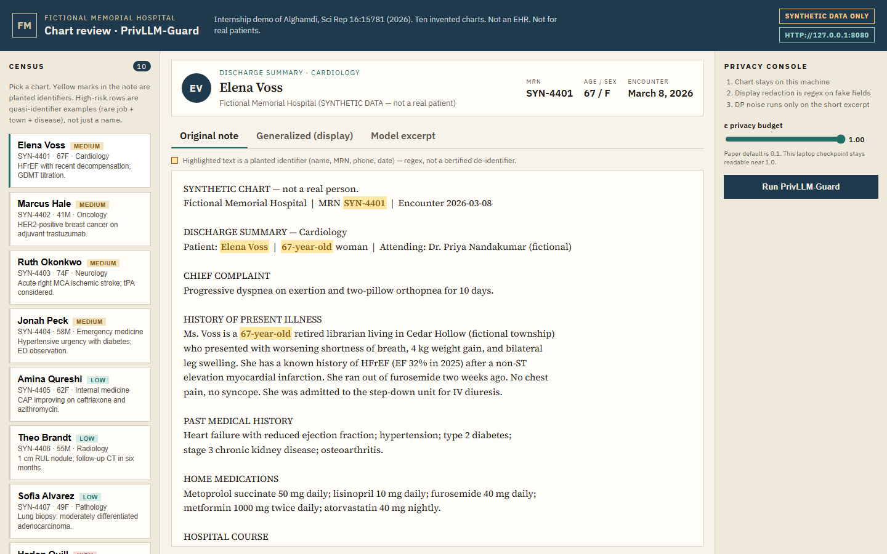
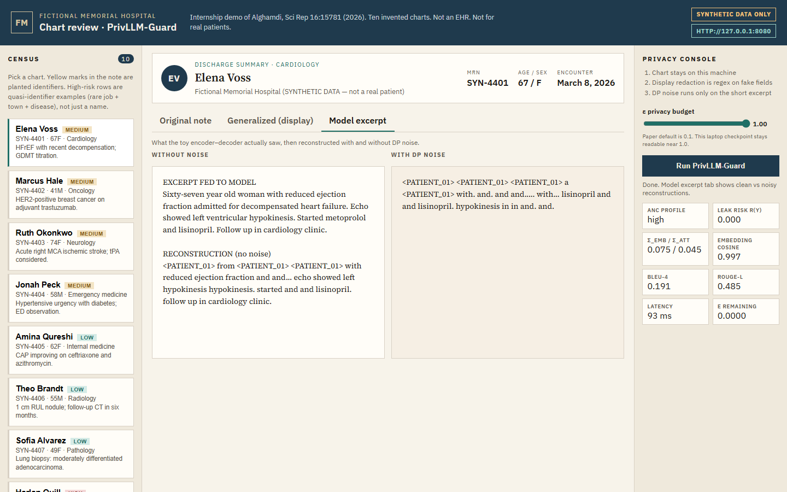
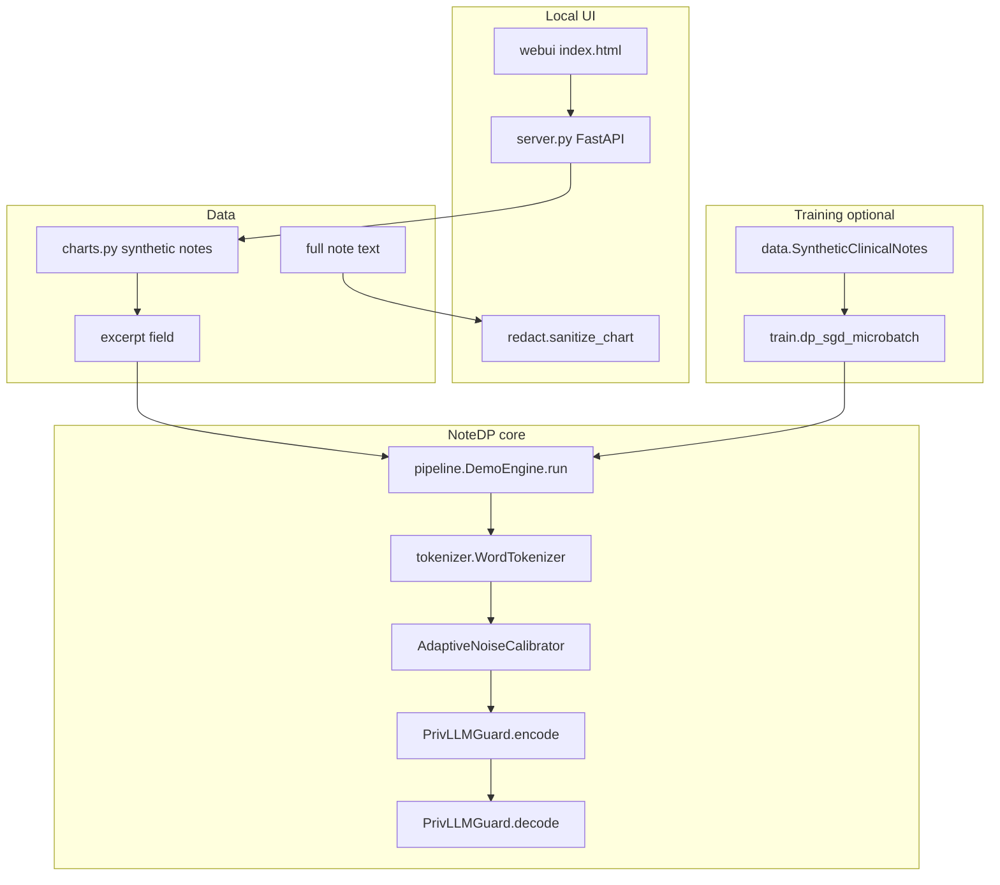
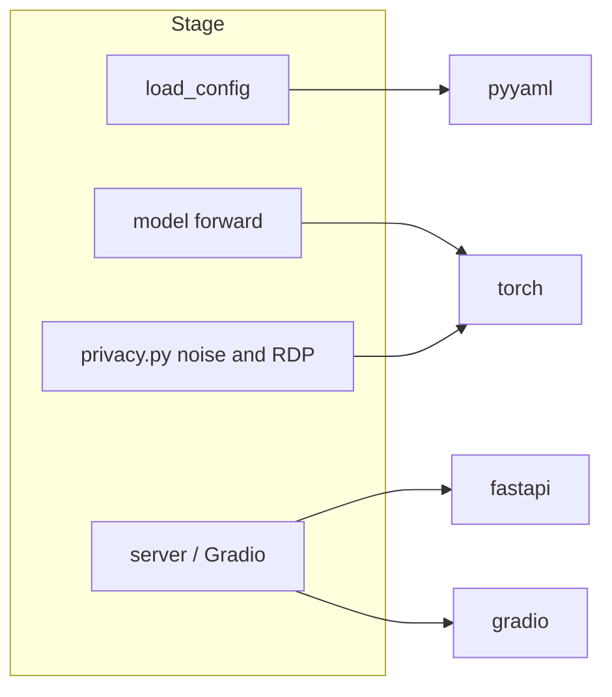
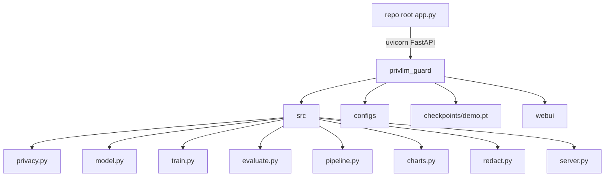

# NoteDP

Clinical NLP needs a language model over discharge summaries, med lists, and H&Ps. The data for that job are token sequences from identifiable records. Same tokens, two uses: clinical signal and identity.

That yields two leakage channels.

1. **Training.** Fit on raw notes and the model can memorize rare n-grams (an MRN, or occupation + town + diagnosis) and emit them later. DP-SGD and representation noise are the formal response: one record should not change the released model much.
2. **Inference.** Paste a note into a hosted prompt and the record has left the machine. Running locally avoids that channel. It does not, by itself, stop hidden states or generations from carrying identity.

Deleting surface names is not a privacy proof. Quasi-identifiers stay in the sequence. Alghamdi’s **PrivLLM-Guard** (*Sci Rep* 16:15781, 2026) puts the protection in the network: Gaussian noise on embeddings (Eq. 3) and attention (Eq. 4), hierarchical ε, RDP accounting, budget monitoring at decode. The paper’s claim is train-and-generate under a stated (ε, δ).

This repo (**NoteDP**) is that method at CPU scale, with a UI over **synthetic notes** in `src/charts.py` (ten invented records, e.g. Elena Voss / `SYN-4401`). The module name `charts.py` is leftover; the objects are notes. The network sees `excerpt` only. `redact.sanitize_chart` is display-side regex, not DP. Not an EHR. Not MIMIC Table 2.

## Display redaction vs DP

**Rendered text.** Substitute planted identifiers so a viewer is not looking at raw names and phones. No membership-inference bound.

**Model path.** `PrivLLMGuard` perturbs representations and spends ε. `POST /api/run` sends the excerpt, not the full note.

The UI shows both so “anonymize the text” and “DP the model” stay distinct.

## What you get

- A citation-anchored PyTorch stack under `privllm_guard/src/` (privacy math, model, losses, DP-SGD training, metrics).
- YAML configs for paper-scale settings (`configs/base.yaml`), a CPU walkthrough (`configs/walkthrough.yaml`), and a demo checkpoint (`configs/demo.yaml`).
- Ten synthetic clinical notes in `src/charts.py` (invented names, MRNs like `SYN-4401`, phones, towns).
- A local FastAPI UI (`src/server.py`, `webui/`) at `http://127.0.0.1:8080`.
- An optional Gradio UI (`src/demo_ui.py`, `privllm_guard/app.py`).
- A pre-trained tiny CPU checkpoint at `privllm_guard/checkpoints/demo.pt` (overfits the synthetic excerpts for the demo).
- Reproduction notes that mark what the paper specified vs what was guessed (`REPRODUCTION_NOTES.md`).
- MIT license (`LICENSE`). Hosting notes in `DEPLOY.md`.


## Screenshots

Local UI over synthetic notes (planted identifiers marked):



After **Run**, the model tab shows the excerpt reconstructed without noise vs with DP noise:



## Pipeline




### One run of the local UI

1. Browser loads `/` → `server.index` serves `webui/index.html`.
2. `GET /api/charts` → `list_charts()` returns the synthetic records.
3. `GET /api/charts/{id}` → full note, `sanitize_chart()`, `find_highlights()`.
4. `POST /api/run` → `DemoEngine.run(excerpt, epsilon)`:
  - `WordTokenizer.encode`
  - `PrivLLMGuard` forward with and without noise (`apply_noise`)
  - metrics: risk, σ, BLEU/ROUGE between reconstructions, hierarchical ε split
5. UI shows original note, generalized note, clean reconstruction, private reconstruction.


## Tools used


| Library               | Role in this repo                             |
| --------------------- | --------------------------------------------- |
| `torch`               | Encoder-decoder, DP-SGD, noise tensors        |
| `pyyaml`              | Load `configs/*.yaml` via `utils.load_config` |
| `numpy`               | Declared; used lightly where needed           |
| `fastapi` / `uvicorn` | Local API and static UI                       |
| `pydantic`            | Request body for `/api/run` (via FastAPI)     |
| `gradio`              | Alternate demo UI in `demo_ui.py`             |





## Architecture




Major folders:


| Path                       | What it holds                                                      |
| -------------------------- | ------------------------------------------------------------------ |
| `privllm_guard/src/`       | Library: privacy, model, train, eval, synthetic notes, UI          |
| `privllm_guard/configs/`   | Hyperparameters (paper / walkthrough / demo)                       |
| `privllm_guard/webui/`     | HTML/CSS/JS for the local note UI                                  |
| `privllm_guard/notebooks/` | Equation walkthrough notebook                                      |
| `privllm_guard/scripts/`   | `train_demo_checkpoint.py`                                         |
| `docs/screenshots/`        | Local UI captures                                                  |
| `web/`                     | Optional static Vercel shell (iframe only; does not run the model) |


## Results

There is **no** checked-in reproduction of the paper’s BLEU-4 = 0.897 / ROUGE-L = 0.923 on MIMIC-III. Those numbers appear only as citations in docs. What exists locally:

- Walkthrough notebook sanity checks for shapes and Privacy Score arithmetic.
- Demo checkpoint training logs from `scripts/train_demo_checkpoint.py` (toy loss on synthetic excerpts).
- Live UI metrics (cosine, BLEU between noisy and clean reconstructions) computed at runtime. These are not published benchmark tables.


## Quickstart (Windows)

From the **repo root**:

```powershell
python -m pip install -r requirements.txt
python app.py
```

Open [http://127.0.0.1:8080](http://127.0.0.1:8080).

Optional Gradio UI:

```powershell
cd privllm_guard
python app.py
```

Optional retrain of the tiny demo weights:

```powershell
cd privllm_guard
python scripts/train_demo_checkpoint.py
```

Optional DP-SGD toy loop:

```powershell
cd privllm_guard
python -m src.train
```


## Project tree

```text
.
├── LICENSE
├── README.md
├── .env.example
├── pytest.ini
├── app.py                          # FastAPI UI on :8080
├── requirements.txt
├── DEPLOY.md                       # hosting notes (HF PRO, Vercel limits)
├── docs/screenshots/
├── privllm_guard/
│   ├── app.py                      # Gradio entry
│   ├── configs/                    # base.yaml, walkthrough.yaml, demo.yaml
│   ├── checkpoints/demo.pt         # tiny CPU demo weights
│   ├── notebooks/walkthrough.ipynb
│   ├── scripts/train_demo_checkpoint.py
│   ├── tests/                      # pytest smokes
│   ├── webui/                      # local UI static files
│   ├── REPRODUCTION_NOTES.md
│   └── src/
│       ├── privacy.py              # GaussianMechanism, RDP, ANC, monitor
│       ├── model.py                # PrivLLMGuard encoder-decoder
│       ├── loss.py                 # combined_loss, distillation
│       ├── train.py                # dp_sgd_microbatch
│       ├── evaluate.py             # bleu4, rouge_l, generate_private
│       ├── data.py                 # SyntheticClinicalNotes
│       ├── charts.py               # 10 synthetic notes (`SyntheticChart`)
│       ├── redact.py               # display generalization
│       ├── pipeline.py             # DemoEngine.run
│       ├── server.py               # FastAPI routes
│       ├── demo_ui.py              # Gradio
│       └── tokenizer.py
└── web/                            # static iframe landing (optional)
```


## How it works (a bit more technical)

Paper reference: Alghamdi, *An adaptive differential privacy framework for clinical LLMs…*, Sci Rep 16:15781 (2026), DOI [10.1038/s41598-026-45883-6](https://doi.org/10.1038/s41598-026-45883-6).

Core pieces mapped to code:


| Paper idea                                     | Code                                               |
| ---------------------------------------------- | -------------------------------------------------- |
| Embedding noise (Eq. 3)                        | `PrivacyAwareEmbedding` in `model.py`              |
| Attention noise (Eq. 4)                        | `PrivacyAwareAttention` in `model.py`              |
| Gradient clip + Gaussian DP-SGD (Eqs. 5-6, 11) | `AdaptiveGradientClipping`, `dp_sgd_microbatch`    |
| Hierarchical ε (Eq. 9)                         | `configs/*.yaml` `epsilon_enc/dec/att/out`         |
| RDP accounting (Eqs. 16-17)                    | `RDPAccountant`                                    |
| Sliding-window budget (Eqs. 18-19)             | `PrivacyBudgetTracker`, `RealTimePrivacyMonitor`   |
| Exponential mechanism (Eq. 7)                  | `exponential_mechanism_sample`, `generate_private` |
| Once-per-sequence ANC                          | `AdaptiveNoiseCalibrator`, `SensitivityAnalyzer`   |


The demo checkpoint is trained **without** full DP-SGD (higher LR, synthetic overfitting) so the UI can show readable reconstructions. Paper-style DP-SGD lives in `train.py`. See `REPRODUCTION_NOTES.md` for paper vs official GitHub disagreements.

## API reference (local FastAPI)


| Method | Path                     | Handler                                    |
| ------ | ------------------------ | ------------------------------------------ |
| GET    | `/`                      | `server.index`                             |
| GET    | `/api/charts`            | `api_charts`                               |
| GET    | `/api/charts/{chart_id}` | `api_chart`                                |
| POST   | `/api/run`               | `api_run` body `{ "chart_id", "epsilon" }` |


## Tests

```powershell
python -m pip install -r requirements.txt
python -m pytest -q
```

Coverage is smoke-level: dataset size, `sanitize_chart` / highlights, Gaussian σ, and FastAPI `GET /` plus note routes. There is no test that trains the paper-scale model or hits MIMIC.

## License

MIT. See [LICENSE](LICENSE).

## Limitations

- **No real patient data.** Notes in `charts.py` are synthetic. Do not paste real PHI into the UI.
- **Does not reproduce paper Table 2** (MIMIC-III / i2b2 / 8×A100).
- **Tiny demo model** (`d_model=64`, short excerpts). Full notes are shown in the UI; the model only sees the `excerpt` field.
- **Hosted demo:** Hugging Face Gradio Spaces currently require PRO on free CPU. Vercel cannot run PyTorch. Use the local UI (`python app.py`). Details in `DEPLOY.md`.
- Official paper code at `ansbuedu/code5` differs from several equations; this repo follows the paper body where they conflict.


## Paper

```bibtex
@article{alghamdi2026privllmguard,
  title   = {An adaptive differential privacy framework for clinical llms with context-aware noise calibration, hierarchical budgeting, and real-time auditing},
  author  = {Alghamdi, Ans D.},
  journal = {Scientific Reports},
  volume  = {16},
  pages   = {15781},
  year    = {2026},
  doi     = {10.1038/s41598-026-45883-6}
}
```

