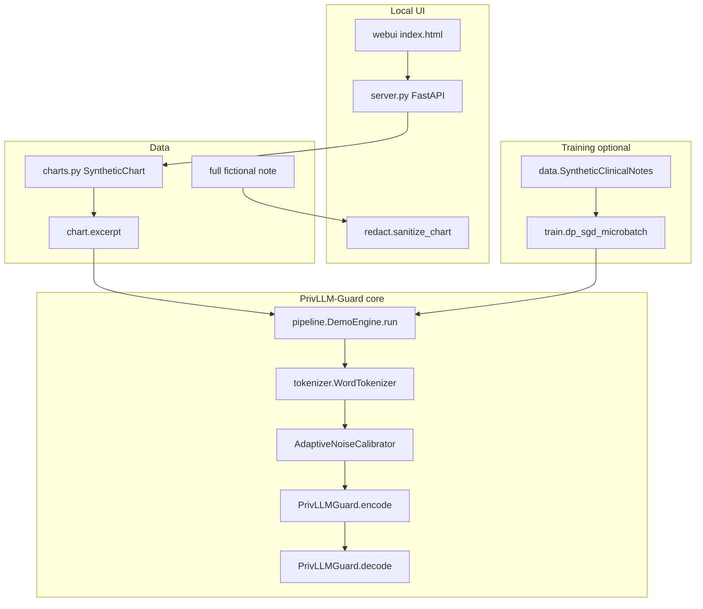

# ChartCloak

Hospitals and clinics want language models to help with notes — summarize a discharge summary, draft a progress note, pull out a medication list. The catch is obvious to anyone who has read a chart: those documents talk about real people. If you send the raw text to a model, or train a model on it carelessly, pieces of a patient’s story can leak back out.

**ChartCloak** is a laptop demo of that problem. Under the hood it implements **PrivLLM-Guard**, the method from Alghamdi’s 2026 *Scientific Reports* paper: a small encoder–decoder that injects calibrated Gaussian noise into embeddings and attention, splits a privacy budget across parts of the network, and tracks that budget while text is produced. A browser UI lets you open **fictional** charts, see a generalized version of the note, and run the tiny model on a short excerpt.

It is meant for students, researchers, and internship demos who want to see how the paper’s pieces fit together on a laptop — not for treating patients, and not as a claim that Table 2’s published BLEU numbers were reproduced here.

## The problem

Clinical text is useful for automation and dangerous for privacy at the same time. Names are only part of the issue. Age, rare jobs, small towns, and uncommon diseases can still point to one person. This repo explores one published answer: **differential privacy inside the model**, plus a demo layer that generalizes identifiers on synthetic charts for display.

## What you get

- A citation-anchored PyTorch stack under `privllm_guard/src/` (privacy math, model, losses, DP-SGD training, metrics).
- YAML configs for paper-scale settings (`configs/base.yaml`), a CPU walkthrough (`configs/walkthrough.yaml`), and a demo checkpoint (`configs/demo.yaml`).
- Ten fictional EHR-style charts in `src/charts.py` (fake names, MRNs like `SYN-4401`, invented phones and towns).
- A local FastAPI + static chart UI (`src/server.py`, `webui/`) at `http://127.0.0.1:8080`.
- An optional Gradio UI (`src/demo_ui.py`, `privllm_guard/app.py`).
- A pre-trained tiny CPU checkpoint at `privllm_guard/checkpoints/demo.pt` (overfits the synthetic excerpts for the demo).
- Reproduction notes that mark what the paper specified vs what was guessed (`REPRODUCTION_NOTES.md`).
- MIT license (`LICENSE`). Hosting notes in `DEPLOY.md`.

## Screenshots

Local chart review (fictional census, original note with planted identifiers marked):

After **Run ChartCloak**, the model tab shows the excerpt reconstructed without noise vs with DP noise:

## Pipeline

### One run of the chart UI

1. Browser loads `/` → `server.index` serves `webui/index.html`.
2. `GET /api/charts` → `list_charts()` returns the census.
3. `GET /api/charts/{id}` → full note, `sanitize_chart()`, `find_highlights()`.
4. `POST /api/run` → `DemoEngine.run(excerpt, epsilon)`:
   - `WordTokenizer.encode`
   - `PrivLLMGuard` forward with and without noise (`apply_noise`)
   - metrics: risk, σ, BLEU/ROUGE between reconstructions, hierarchical ε split
5. UI shows original note, generalized note, clean reconstruction, private reconstruction.
